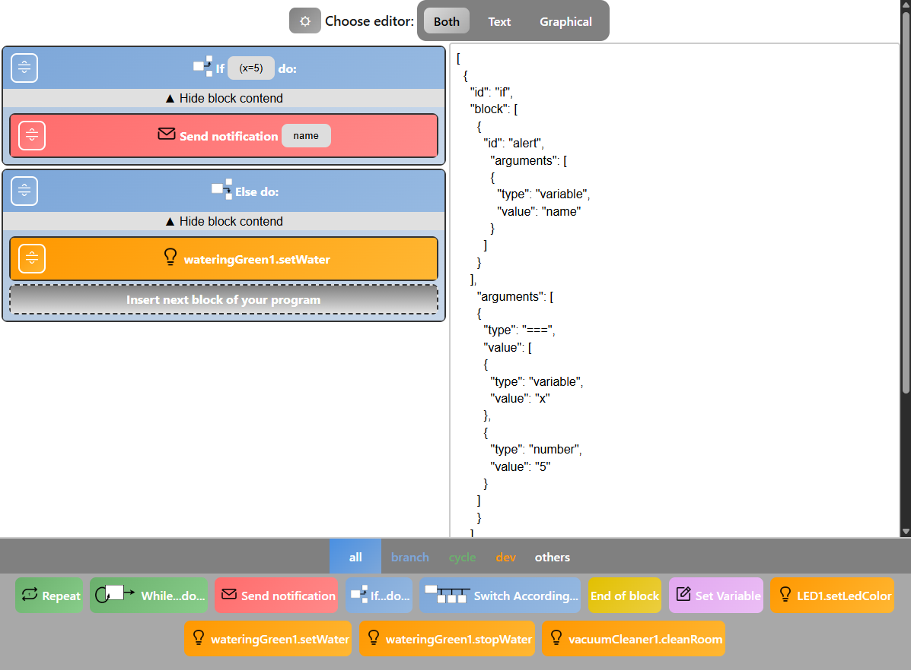
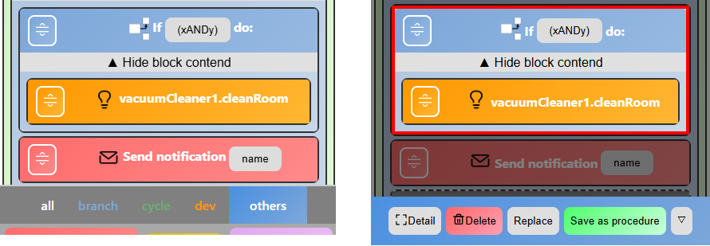
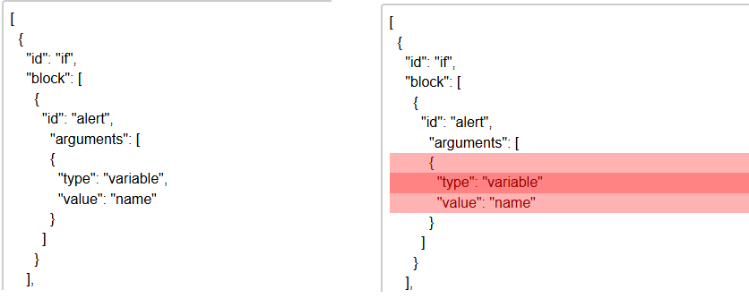
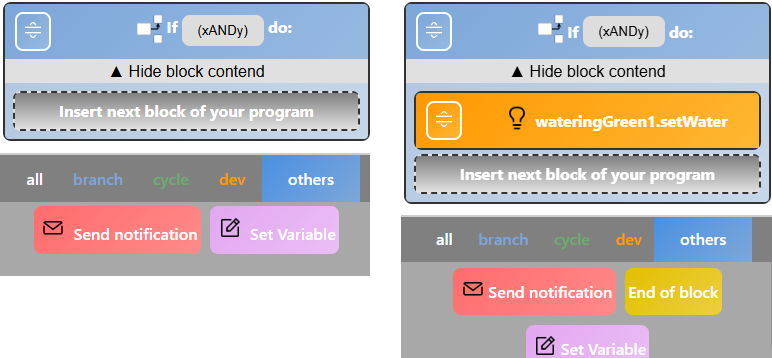
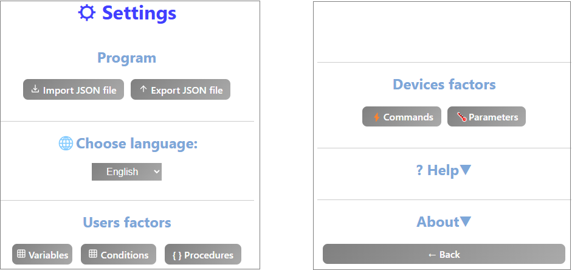

# **iot-vpl-ditor**
VPL editor for automatization of smart devices on mobile phones. 

## **Overview**
It was developed for project Pocketix by David Škrabal. This editor uses a block and form based visual programming language **Pocketix**. VPL **Pocketix** is designed designed for automating IoT and smart home devices. This editor is implemented as a library and uses Lit library. 

You can try this editor [here](https://david-mobile.iot.petr-john.cz/). 

## **Features**
✅ Editor for automation of IoT devices  
✅ Designed for mobile devices  
✅ Drag-and-drop interface with user's program configuration  
✅ Implemented as a library: 
  - [Web Components](https://www.webcomponents.org/)
  - [Lit](https://lit.dev/)
  - [Typescript](https://www.typescriptlang.org/)

## **Installation**

### **Local Project Setup**

Building of the library locally for development purposes:

```sh
git clone https://github.com/pocketix/iot-vpl-editor.git
```

```sh
cd iot-vpl-editor
```

```sh
npm install
```

#### **Compile and Hot-Reload for Development**

```sh
npm run dev
```

#### **Type-Check, Compile and Minify for Production**

```sh
npm run build
```

### **Integration into your own web project**

### Step 1: install library with npm install
```sh
npm install git+https://github.com/pocketix/iot-vpl-editor.git
```

### Step 2: install library with npm install
Create file main.js for importing library: 
```js
import './node_modules/@pocketix/iot-vpl-editor/dist/iot-vpl-editor.js';
import './node_modules/@pocketix/iot-vpl-editor/dist/iot-vpl-editor.css';
```

### Step 3: Add folder /img from /public to your project

### Step 4: Add library to your HTML page as you would use any other HTML Element
```html
<!DOCTYPE html>
<html lang="en">
  <head>
    ... 
  </head>
  <body>
    ...
    <main-element></main-element>
    <script type="module" src="./main.js"></script>
    ...
  </body>
</html>

```

## **Overview**
Editor consist of three main parts: menu, editor and offer. Editor has two views: graphical and text view. Graphical/text editor and offer are synchronized, so adding component through offer is reflected in text and graphical view. 



### **Graphical View**

Graphical view consists of individual program blocks. User can move blocks with drag and drop button, or hold block to display menu of actions for particular block. There are actions delete, move, and replace in this menu. 



### **Text View**

Text view shows user's program in JSON form. User can make some changes here. Text view can be connected with library for syntax check of program. In this case it can alert user to syntax mistakes. 



### **Offer**
Offer is filtered according to actual state of progam. Usen can add only szntax correct blocks. There is menu in this offer. It filter options according to type of block. 



### **Settings**
There is a button for settings window in the menu of main page. User can import/export program to editor, change language of editor, create and edit variables and conditions, and see information about connected devices. 



## **Related Projects**
- 🔗 [vpl-for-things](https://github.com/pocketix/vpl-for-things) — WIP version of new editor built in Lit compatible with Pocketix v2 language
- 🔗 [pocketix-react](https://github.com/pocketix/pocketix-react) — Previous React version of the editor
- 🔗 [pocketixng](https://github.com/pocketix/pocketixng) — Previous Angular-based version of the editor

## **License**
This project is licensed under the MIT License.  
See the [LICENSE](LICENSE) file for full details.